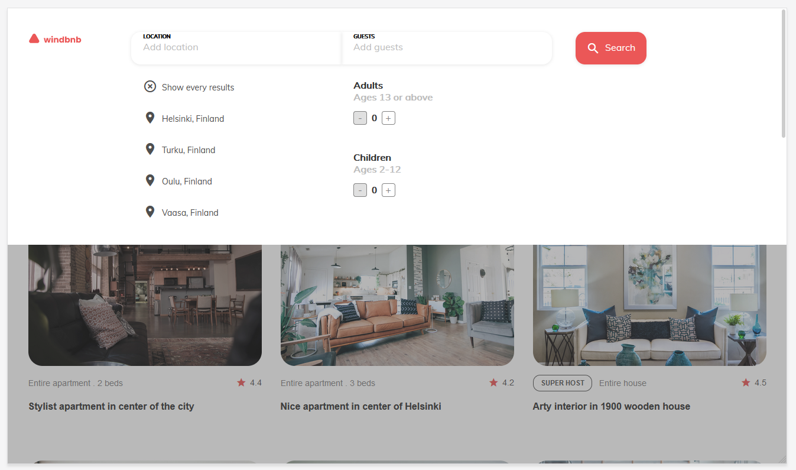

<h1 align="center">Windbnb</h1>

<div align="center">
   Solution for a challenge from  <a href="http://devchallenges.io" target="_blank">Devchallenges.io</a>.
</div>

<div align="center">
  <h3>
    <a href="https://camain-elie.github.io/windbnb/" target="_blank">
      Demo
    </a>
    <span> | </span>
    <a href="https://github.com/camain-elie/windbnb">
      Solution
    </a>
    <span> | </span>
    <a href="https://devchallenges.io/challenges/3JFYedSOZqAxYuOCNmYD">
      Challenge
    </a>
  </h3>
</div>

<!-- TABLE OF CONTENTS -->

## Table of Contents

- [Overview](#overview)
  - [Built With](#built-with)
- [Features](#features)
- [How to use](#how-to-use)
- [Contact](#contact)
- [Acknowledgements](#acknowledgements)

<!-- OVERVIEW -->

## Overview



My take on devchallenge.io's Windbnb challenge. I did it as a training project to get more confortable when using React. And sure I did. I learned a lot about React, especially about the events and rerenders of the components.

I also improved a bit in scss (and css) through this project.

### Built With

<!-- This section should list any major frameworks that you built your project using. Here are a few examples.-->
Technologies used :
- [React](https://reactjs.org/)
- [Create-React-App](https://create-react-app.dev/)
- [Sass](https://sass-lang.com/)

## Features

<!-- List the features of your application or follow the template. Don't share the figma file here :) -->

This application/site was created as a submission to a [DevChallenges](https://devchallenges.io/challenges) challenge. The [challenge](https://devchallenges.io/challenges/3JFYedSOZqAxYuOCNmYD) was to build an application to complete the given user stories.

## How To Use

<!-- Example:  -->

To clone and run this application, you'll need [Git](https://git-scm.com) and [Node.js](https://nodejs.org/en/download/) (which comes with [npm](http://npmjs.com)) installed on your computer. From your command line:

```bash
# Clone this repository
$ git clone https://github.com/camain-elie/windbnb.git

# Install dependencies
$ npm install

# Run the app
$ npm start
```

## Acknowledgements

<!-- This section should list any articles or add-ons/plugins that helps you to complete the project. This is optional but it will help you in the future. For exmpale -->

- [Node.js](https://nodejs.org/)
- [React.js](https://fr.reactjs.org/)

## Contact

- GitHub [@camain-elie](https://github.com/camain-elie)
